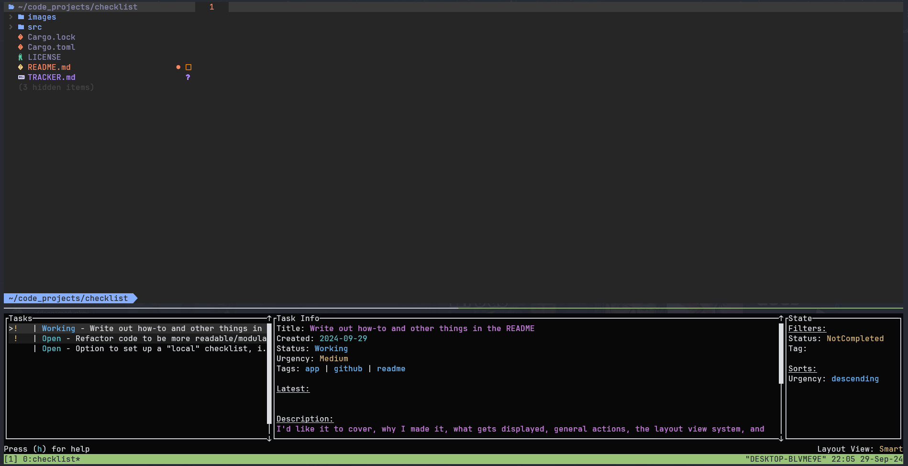
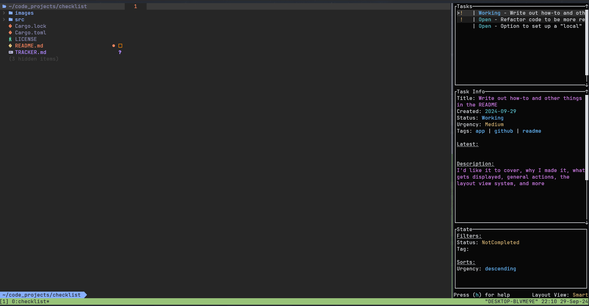
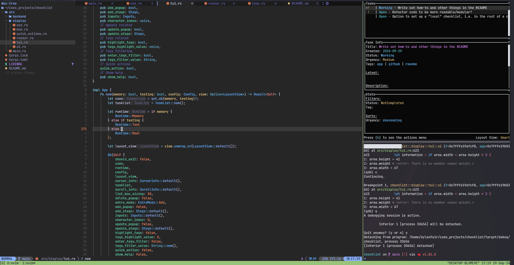
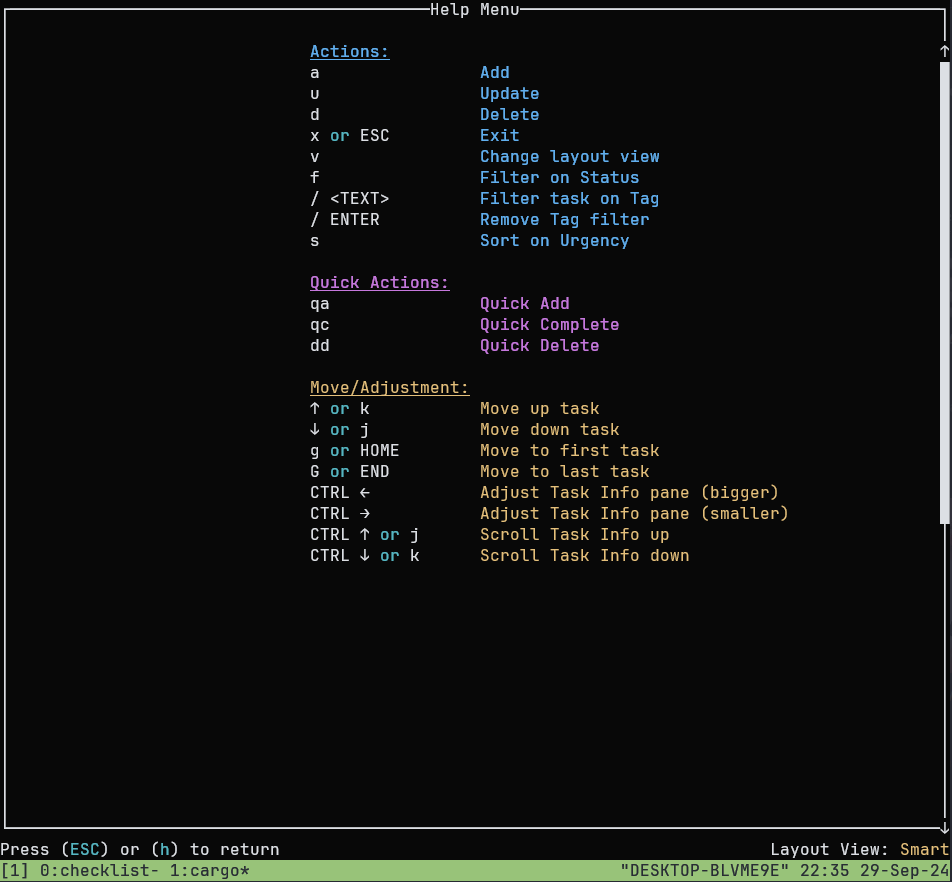

# checklist

Yet another todo TUI app (I know), meant to be used regardless of terminal size.

## Installation

At the moment cloning from this GitHub and installing with cargo is the best way to install this.

```sh
git clone git@github.com:dylanfair/checklist.git
cargo install --path ./checklist
```

In the future I can learn how to get this installed elsewhere. :)

## Why checklist?

What I wanted for myself was a todo TUI that I could use in a constrained terminal space, like if I just had a slim bar horizontally or vertically. Something I could have off to the side without needing to completely full-screen in order to log some tasks. Now `checklist` can still be used as a full-screen app, but it wasn't my primary goal. Below are some pictures of how `checklist` will conform depending on the terminal size it's been given. 


*`checklist` in a horizontal view*


*`checklist` in a vertical view*


*`checklist` crammed in the top right corner*

There's a long way to go and likely some subjectivity on how to make this more effective, but I hope this gives you a general idea of what I'm aiming for here. `checklist` will automatically shift between a `Horizontal` or `Vertical` view based on terminal area conditions, however you can also explicitly choose to be in `Horizontal` or `Vertical` view if you want.

## So what else?

Besides that, `checklist` will have your typical todo app features:

* Adding a task
* Updating a task
* Deleting a task

A task can have attributes such as:

* Urgency (Low, Medium, High, Critical)
* Status (Open, Working, Paused, Completed)
* Tags (which can be filtered for)
* And space to write out a description or maybe the latest update

Speaking of filters, as of now (September 2024) the only other filter is by `Status` (Completed, NotCompleted, and All), and you can sort `Urgency` in an ascending or descending manner (Critical > High > Medium > Low). This is stuff I'd like to eventually flesh out a bit more.

The keybindings take inspiration from vim motions, such as `j` and `k` for moving up and down the task list. A full listing can be found when hitting `h` in the app.



## Getting started

Once you have `checklist` installed, you can get started with:

```sh
checklist
```

Easy enough! On first time use before opening up the TUI, this will create a SQLite database, configuration file, and theme.toml in your local configuration directory - likely one of the following places:

Linux: `/home/<USER>/.config/checklist/` \
Windows: `C:\Users\<USER>\AppData\Local\checklist\` \
Mac*: `~/Library/Application Support/checklist/`

> *I don't have a Mac so haven't tested this, but I believe that's where it will go 

The SQLite database are where your tasks are stored.

You can always check where the database lives with: 

```sh
checklist where
```

If you want to point `checklist` to a specific SQLite database (say you moved your files to a new computer), that can be done with:

```sh
checklist init --set <DB PATH>
```

There are only a couple other commands from the CLI that you need to know:

```sh
checklist wipe
```

This will wipe out all tasks in your database should you accept the confirmation prompt -- use with caution.


`checklist display` will open up the TUI just like `checklist` by itself would, but it does also allow you to preemptively set the layout view you want to use with the `-v` flag, like so:

```sh
checklist display -v horizontal
```

## In the App

### Simple Commands

Once in the app, we can get started by adding in a task! This can be done wither either `a`, which will take you step by step through adding a task and it's attributes. The alternative is `qa`, which will only require you to supply a name before making a task.

To update, `u` followed by a corresponding number will allow you to change that element for the currently selected task.

To delete, `d` will prompt you with a `y` or `n` whether you want to delete it. `dd` is an alternative to delete quickly.

`qc` will mark the selected task as `Complete` if not already. If used on a task that is complete, it will mark it as `Open`. This is mostly to save time from going to update, then status, and then marking the task `Complete`.

### Configuration memory

`checklist` will remember the last `Status` filter and `Urgency` sort you had if you are to exit out and come back. Other "state" like any current `Tag` filter, or the current `Layout View`, are not kept.

## Customization

There is a `theme.toml` file that is in the same location as your SQLite database (which can be found with `checklist where`). Here you can change background colors, outline colors, scrollbar colors and a couple styles. This isn't fully fleshed out, but hopefully acts as a good start.

## VSCode oddity

I noticed that if running the app in a VSCode terminal, I needed to set the following setting in order for certain command combinations (i.e. CTRL \<down>) to work:

`"terminal.integrated.sendKeybindingsToShell": true`

So if you are running into a similar issue, that might resolve it.
