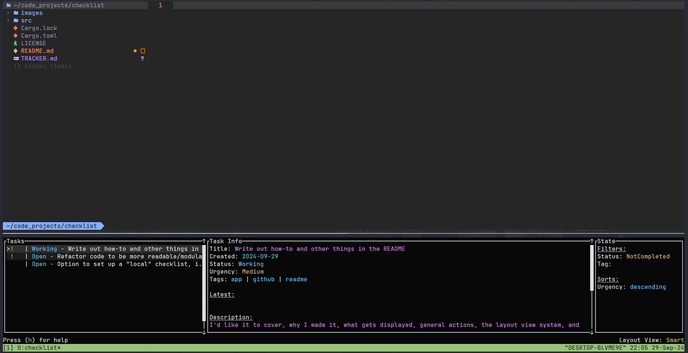
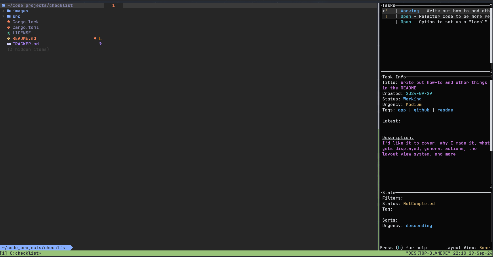
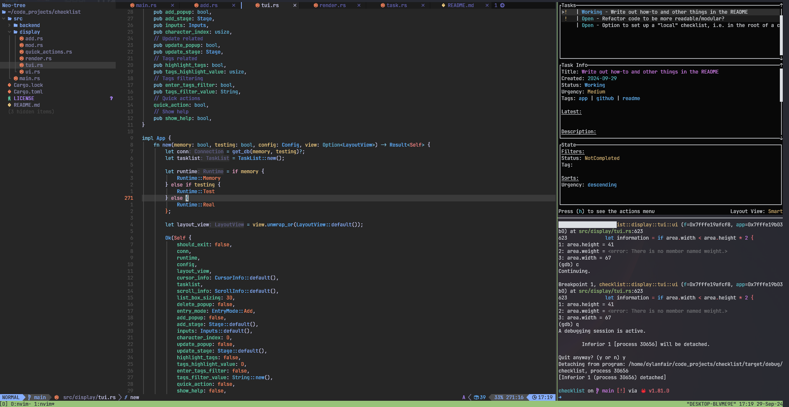
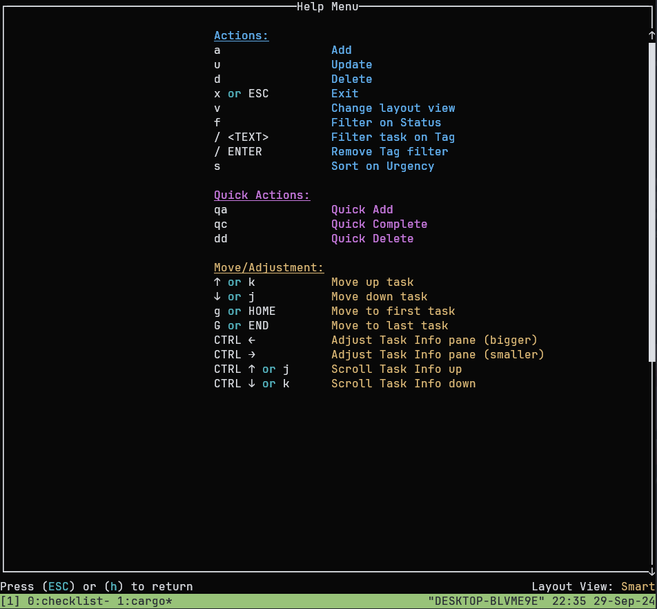

# checklist

Yet another todo TUI app (I know), meant to be used regardless of terminal size.

> NOTE: As a heads up, starting from `v0.1.7`, AI assistance is used. As this is primarily a pet project, I'm planning to use this as a good way to get myself familiar with incorporating agents into a workflow. Just wanted to be upfront with that!

## Installation

At the moment you can install this from crates.io

```sh
cargo install checklist-tui
```

In the future I can learn how to get this installed elsewhere. :)

## Why checklist?

What I wanted for myself was a todo TUI that I could use in a constrained terminal space, like if I just had a slim bar horizontally or vertically. Something I could have off to the side without needing to completely full-screen in order to log some tasks. Now `checklist` can still be used as a full-screen app, but it wasn't my primary goal. Below are some pictures of how `checklist` will conform depending on the terminal size it's been given.


_`checklist` in a horizontal view_


_`checklist` in a vertical view_


_`checklist` crammed in the top right corner_

There's a long way to go and likely some subjectivity on how to make this more effective, but I hope this gives you a general idea of what I'm aiming for here. `checklist` will automatically shift between a `Horizontal` or `Vertical` view based on terminal area conditions, however you can also explicitly choose to be in `Horizontal` or `Vertical` view if you want.

## So what else?

Besides that, `checklist` will have your typical todo app features:

- Adding a task
- Updating a task
- Deleting a task

A task can have attributes such as:

- Urgency (Low, Medium, High, Critical)
- Status (Open, Working, Paused, Completed)
- Tags (which can be filtered for)
- And space to write out a description or maybe the latest update

Speaking of filters, as of now (September 2024) the only other filter is by `Status` (Completed, NotCompleted, and All), and you can sort `Urgency` in an ascending or descending manner (Critical > High > Medium > Low). This is stuff I'd like to eventually flesh out a bit more.

The keybindings take inspiration from vim motions, such as `j` and `k` for moving up and down the task list. A full listing can be found when hitting `h` in the app.



## Getting started

Once you have `checklist` installed, you can get started with:

```sh
checklist
```

Easy enough! On first time use before opening up the TUI, this will create a SQLite database, configuration file, and theme.toml in your local configuration directory - likely one of the following places:

Linux: `/home/<USER>/.config/checklist/` \
Windows: `C:\Users\<USER>\AppData\Local\checklist\` \
Mac\*: `~/Library/Application Support/checklist/`

> \*I don't have a Mac so haven't tested this, but I believe that's where it will go

The SQLite database is where your tasks are stored.

When you update `checklist`, any database schema changes ship as automatic migrations — the first launch after an update applies them in order before the app opens. No manual steps are needed, and your data is untouched (each migration runs in a transaction, so an interrupted upgrade simply retries next time). Before an upgrade applies, a snapshot of your database is kept in a `checklist-migration-snapshots/` folder next to it (e.g. `checklist.sqlite.pre-migration-v0.bak`) — if anything ever goes wrong, one of those files can be restored and used with the previous version of `checklist`.

### Moving between schema versions

The database format occasionally changes between releases. `checklist migrate` lets you inspect where your database sits and move it deliberately:

```sh
checklist migrate # shows your current schema version and what this build supports
```

Say you want to share your database (or a copy of it) with another machine that still runs an older `checklist`. A database written by a newer release can't be opened by older releases as-is, but you can migrate it down first:

```sh
checklist migrate --prior # step back one schema version
```

You'll be shown what's about to happen and asked to confirm. Afterwards you'll see something like:

```sh
Database migrated down to schema version 0.
Databases at this version are opened by checklist versions before v0.1.9.
```

so you know exactly which release can read it. If you know the exact version you want instead of stepping back one at a time, use `--to`:

```sh
checklist migrate --to 0
```

Every move takes a fresh snapshot into `checklist-migration-snapshots/` beforehand, so nothing is lost if you change your mind — restore the snapshot, or just run `checklist` again: launching this version of `checklist` will upgrade the database forward automatically. You can also make that explicit with:

```sh
checklist migrate --latest
```

Note that moving *up* never prompts (it's the same thing a normal launch does); only moves that go backwards ask for confirmation.

You can always check where files related to checklist live with:

```sh
checklist where # returns the folder that holds checklist related files
```

To get specific files:

```sh
checklist where -d # SQLite database
checklist where -c # config.json file
checklist where -t # theme.toml file
```

If you want to point `checklist` to a specific SQLite database (say you moved your files to a new computer), that can be done with:

```sh
checklist init --set <DB PATH>
```

If a directory path is given instead, `checklist` will create a `checklist.sqlite` in that location. If a `checklist.sqlite` is already found in that directory, then `checklist` simply uses that database.

If you instead want to import tasks from another `checklist` SQLite database (i.e. you want to merge the tasks from one database with your current one), that can be done with the `checklist import` command. Databases created by older versions of `checklist` import just fine — their data is read and written into the current format.

```sh
checklist import <DB PATH>
```

If you'd like to jump straight into the TUI after the import finishes, pass `--display`. You can also pair it with `-v/--view` to pick the starting layout view:

```sh
checklist import --display <DB PATH>
checklist import --display -v vertical <DB PATH>
```

This works with `--memory` too — the tasks are imported into the in-memory database and then displayed, so you can preview an import without writing to disk.

There are only a couple other commands from the CLI that you need to know:

```sh
checklist wipe
```

This will wipe out all tasks in your database should you accept the confirmation prompt -- use with caution.

`checklist display` will open up the TUI just like `checklist` by itself would, but it does also allow you to preemptively set the layout view you want to use with the `-v` flag, like so:

```sh
checklist display -v horizontal
```

## In the App

### Simple Commands

Once in the app, we can get started by adding in a task! This can be done wither either `a`, which will take you step by step through adding a task and it's attributes. The alternative is `qa`, which will only require you to supply a name before making a task.

To update, `u` followed by a corresponding number will allow you to change that element for the currently selected task.

To delete, `d` will prompt you with a `y` or `n` whether you want to delete it. `dd` is an alternative to delete quickly.

`qc` will mark the selected task as `Complete` if not already. If used on a task that is complete, it will mark it as `Open`. This is mostly to save time from going to update, then status, and then marking the task `Complete`.

### Configuration memory

`checklist` will remember the last `Status` filter and `Urgency` sort you had if you are to exit out and come back. Other "state" like any current `Tag` filter, or the current `Layout View`, are not kept.

## Customization

There is a `theme.toml` file (which can be found with `checklist where -t`). Here you can change background colors, outline colors, scrollbar colors and a couple styles. This isn't fully fleshed out, but hopefully acts as a good start.

Currently the customization options fall under three broad categories:

- `theme_colors`
- `text_colors`
- `theme_styles`

`theme_colors` covers color customization for block backgrounds, outlines, and scrollbars.

`text_colors` covers color customization for the colored text in `checklist`.

`theme_styles` covers symbology in `checklist`, like what you want the scrollbar to look like, the highlight symbol, and `Urgency` markings in the `Task` items.

Comments and custom formatting in your `theme.toml` are preserved when the app reads it — checklist only writes the file when it first creates it. If a new release adds theme options you'd like to surface in your existing file, run:

```sh
checklist theme --migrate
```

This re-serializes `theme.toml` with all current keys and defaults. Note that it regenerates the file from the parsed struct, so comments are **not** preserved by a migrate.

## VSCode oddity

I noticed that if running the app in a VSCode terminal, I needed to set the following setting in order for certain command combinations (i.e. CTRL \<down>) to work:

`"terminal.integrated.sendKeybindingsToShell": true`

So if you are running into a similar issue, that might resolve it.
